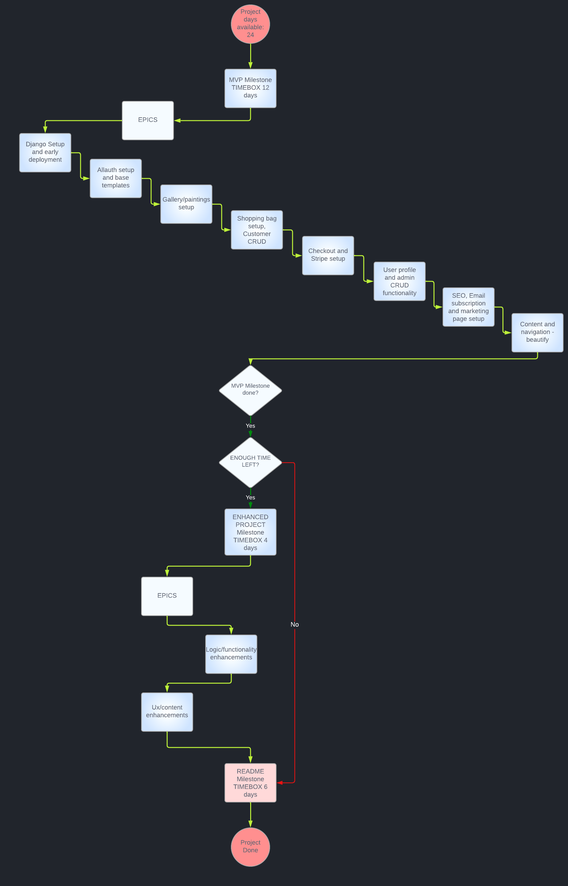

<!-- Code for readme adapted from author's own project (Portfolio 2),
https://github.com/Boiann/budget-calculator -->

# CVEK ART GALLERY

Cvek Art Gallery is a Project 5 for Code Institute Full-stack development program: E-Commerce Applications. It is a B2C platform, gallery/store where the user can purchase painting/s, with added frame and discount options. Using mainly Django, a Python back-end development framework and Bootstrap, front-end (CSS) framework wired up to Stripe, this project was brought to life. Made with passion and meant to honor my father whose abilities, persistence and the thirst for learning keep inspiring. 

Visit the live site - [Cvek Art Gallery](https://cvek-art-gallery-d4a224801c39.herokuapp.com/ "Link to Cvek Art Gallery")

---

## CONTENTS

* [Project Overview](#project-overview)
  * [Project Goals](#project-goals)

* [User Experience](#user-experience)
  * [User Expectations](#user-expectations)
  * [User Stories](#user-stories)

* [Business model](#business-model)
  * [Marketing](#marketing)

* [Design](#design)
  * [Color Scheme](#color-scheme)
  * [Imagery](#imagery)
  * [Structure](#structure)
  * [Database Design](#database-design)
  * [Wireframes](#wireframes)

* [Agile Project Management](#agile-project-management)

* [Features](#features)

* [Future Implementations](#future-implementations)

* [Technologies Used](#technologies-used)
  * [Languages Used](#languages-used)
  * [Programs Used](#programs-used)

* [Deployment](#deployment)

* [Testing](#testing)

* [Credits](#credits)
  * [Code used and adapted](#code-used-and-adapted)
  * [Acknowledgments](#acknowledgments)

---

## **Project Overview**

Cvek Art Gallery was conceptualized a couple of months ago, even before Project 4 was. As the end Project and its requirements were known ahead of time, it was decided to honor Mr. Cvek's painting capabilities and their inherent beauty. It is a B2C (business-to-consumer) platform, gallery/store where the user can view all of the paintings currently for sale. As the paintings for sale are one of a kind, the quantity selector and model were replaced by an option to buy frame/s with the painting. 
Also, the discount on multiple purchases is a nice way of attracting new and keeping old customers. This project was realized using Django, Javascript, jQuery, Python, CSS3, Bootstap and HTML5, wired up to Stripe payment platform.

**Note for testing the checkout functionality:**

The site will not process an actual card payment and no charges will be collected through site and/or Stripe. Also, no orders will be fulfilled or delivered.
To keep your personal information secure, it is advised to use Stripe test Visa card:
* Card Number: 4242 4242 4242 4242
* MM/YY: Any future date in the format MM/YY
* CVC: Any 3 numbers
* ZIP: Any 5 numbers

* **HINT**: When Payment field is selected, just enter 424242... until the end!

### **Project Goals**

 * Develop CAG website using Django and Bootstrap frameworks, wire up to Stripe
 * Present the website in a clean and easy to understand manner
 * Keep good UX principles regarding layout/colors/interaction
 * Robust Python code without issues/bugs
 * Fully responsive, interactive and with feedbacks

[Back to top ⇧](#cvek-art-gallery)

---

## **User Experience**

### **User Expectations**

 - Able to quickly understand what the purpose of the site is
 - Intuitive navigation
 - Responsive across many devices and screen sizes
 - Able to find basic information
 - Find additional info if needed
 - Every interaction has feedback
 - User-friendly
 - See the exact cost of every item
 - Easy and secure checkout
 - Contacting the store through the website
 - See what discounts are applied

### **User Stories**

Many user stories were developed for the project using Agile development methodology, for the full list please see the [CAG Project.](https://github.com/users/Boiann/projects/12 "Link to Cvek Art Gallery Project") The following stories are selected from that project, and are the more important ones.

#### **First Time Visitor**
 * I can open the home page so that I can see what this website is about.
 * I can effectively explore this website so that I can access all the info I need.
 * I can see a list of paintings so that I can select one or more to purchase.
 * I can find out more about the artist so that I can find out more about him.
 * I can modify my shopping bag so that I can adjust my purchase.
 * I can see a notification upon successful modifying/removing so that I can know I'm doing things right.
 * I can connect with the store/business on Facebook so I can follow on any news/updates/special offers.

#### **Returning Customer**
 * I want to be able to register and log in/out without issues.
 * I want to get an email notification so that my registration is confirmed.
 * I can search or sort by category of paintings so that I can select one or more to purchase.
 * I can see if there is anything on special offer so that I can save some money.
 * I can remove paintings from my shopping bag so that I can adjust my purchase.
 * I can have personalized user profile so I can view my order history.
 * I can subscribe to the store newsletter so I can know about any news/updates/special offers.

#### **Website Admin/Owner**
* I can add/remove paintings from the store so I can remove sold out paintings and add new ones.
* I can modify paintings in the store so I can update them with the right details.
* I can see what the customer ordered, how much was paid, and was the discount applied.

[Back to top ⇧](#cvek-art-gallery)

---

## **Business Model**

This site follows a B2C (business-to-consumer) model, selling paintings with or without added extras (frames) directly to the customer. The customer can quickly make a purchase, there is no registration mandatory for checkout. There are multiple tiers of discounts available, for delivery, and for amount of paintings in the cart (buy 3, get €50 off, buy 6 get €100 off). The business is advertised on Facebook, where a real-life site can quickly gain traction and customer base. Primary target audience are customers looking for unique and homemade oil on canvas paintings. The site uses simple and intuitive design, good ux, sign-ups to the newsletter and contact through the site itself, potential deals and more to attract and expand its audience.

### **Marketing**

The site is connected to Facebook where business page was made. The [Facebook link](https://www.facebook.com/people/Cvek-Art-Gallery/61551953037626/) is not guaranteed to not be removed by the time this project is reviewed, and for that reason it is not included in the site footer FB link. FB page was captured in GIF format as proof:

Facebook GIF:

### **Marketing**

The project includes descriptive meta tags in base.html head, sitemap.xm and robots.txt to optimize SEO. Newsletter subscription is also supported via MailChimp. For better SEO all of the paintings added have normal and descriptive names instead of num/char mix, example; "springtime-waterfall-in-forest-painting.webp".

[Back to top ⇧](#cvek-art-gallery)

---

## **Design**

### **Color Scheme**

The color scheme used in the project is not explicitly defined. Using Bootstrap CSS class selectors and templates taken from Boutique Ado project. If not for the background image, it would be dark/black text over white background. This is done on purpose to maintain site cleanliness. Color is added to confirm/cancel buttons in ux standard, red for cancel, green for confirm. Bootstrap toasts use color-coded messages too, blue for info, yellow for warning, red for danger and green for success.

### **Imagery**

All the images of paintings were taken in the home of Mr. Cvek with his blessing. He also approved their usage in this project. Only two images were produced explicitly for the purposes of the project, the logo and favicon. 

The 'noimage' image, used for adding new painting to the store without actual painting image, was included even if it doesn't really make sense to submit a painting for sale without its image. It was kept in for testing purposes.

### **Structure**

  - CAG website is structured in a user-friendly and easy to navigate way.

  - *Home page:*

    - When the index first loads, the user is presented with page explaining the basic purpose of the site utilizing bootstrap carousel image change between three paintings. Each image has a 'shop now' button leading to all paintings for sale paginated page, and a short and strong message - 'Homemade oil paintings, self-taught artist, beautiful imagery.
    - The navigation bar presents the site name, logo, search field, account and basket icons, and selectors for all paintings, categories, subcategories, specials and about sections.
    - Right below the navbar there is an animated marquee banner that cycles special offers
    - The footer contains business email and physical address, popular categories, about and social media links, as well as newsletter subscription button that opens a subscription dedicated page
    - Using MVT-based framework (Model, View, Template) base template is created with head, navigation and footer being the same on all pages, adding specific page content to it.

  - *Navbar*
    
    - First navbar dropdown menu consists of sorting options for paintings, by year, price or category, and 'All Paintings' nav link
    - Second dropdown menu is for exploring Categories
    - Third dropdown is for Subcategories
    - Specials dropdown menu contains New Paintings, Deals, Clearance and 'All Specials' links
    - About dropdown leads to four separate pages; About the Artist, Contact Us, T&C's and Privacy
    - MY Account link and Font Awesome icon is for handling user's login, logout, registering, My Profile page, and admin's access and Paintings Management page 

  - *Footer:*
    - The footer contains business email and physical address, popular categories, about and social media links (opening in separate tabs)
    - At the top of the footer area there is a newsletter subscription button that opens a subscription dedicated page
    - Footer also contains copyright for both this project and paintings property rights.

  - *Registerig, logging in/out:*  
    - First time/unregistered user can successfully make a purchase without registering
    - First time user can register on the register page. The page contains redirect links to login if the user is mistakenly on register page, and link to login page if the user is registered already
    - Upon registering, the 'Register' link is replaced by 'Logout' link, allowing the user to sign out from the site.
    - If the registered user makes a purchase, the personal and delivery details as well as the past order and it's details are visible on 'My Profile' link in the My Account nav dropdown 
    - Logged in admin user will also have additional links in the navbar - 'Paintings management,' for adding paintings for sale and 'Admin Page' which opens admin site in a separate tab.
    - When logging in the user is brought to the index page.
    - When logging out, the user is asked 'Are you sure' before signing out.
    - When signed out, the user is brought to the index page.

  - *Paintings page (this includes all the categories, subcategories and sorting options):*
    - The user is presented with a paginated view of paintings for sale.
    - Each painting card consists of image, price, category name and year it was made.
    - If the user clicks on a painting the detail of the painting is presented
    - All of the paintings have category and subcategory, so it is possible to have a painting in for example, category Flowers but also a subcategory of 'New Paintings'. This is important for a better UX because now if the user selects category 'Flowers', all of the paintings in that category will be included in the result, even if they are in a different subcategories, for example 'Clearance'.

  - *Painting-detail page:*
    - This page shows larger image of the Painting, as well as it's full name, size, price, year of production, add to cart button and frame option dropdown button
    - The customer can choose to add a standard (+€50) or Premium (+€100) frame, which affects the price at the checkout
    - If the painting is in 'clearance' subcategory, no frame options are available (But the painting is sold at reduced price)

  - *Cart page*
    - Consists of the list of paintings user has placed in the cart, current selected frame, with Subtotal calculations on the right depending on if the user wishes to add/remove/change the frame selected
    - There is an remove button so the user can remove paintings from the cart easily
    - If the user is under the free delivery threshold, the message is displayed below the grand total saying that the user can spend just (amount) to get free delivery 
    - Cart total is calculated excluding delivery
    - If user has three or more paintings in the cart, a message appears at the top of the page informing them of their €50 discount
    - If user has six or more paintings in the cart, a message appears at the top of the page informing them of their €100 discount

  - *Checkout page*
    - Checkout page consists of the painting image, title, frame selected and full total of the painting
    - The form for delivery details can be found on the left, after successful purchase the user is presented with checkout success page, holding all of the info from the purchase, painting/s, delivery and personal details, and the email confirmation sent message
    - Order is saved to 'My Profile' page if the user is registered with the site

  - *About pages*
    - About the Artist page is short info and a few images about the author of the paintings
    - Contact Us page contains a form for contacting the business, user is getting a feedback email upon successful form submission, and is redirected back to index page
    - T&C's page contains the site's Terms and conditions
    - Privacy page is where the user can find the site's privacy policy

  - *Error pages*
    - Two error pages are supported, 404 (page not found) and 500 (internal server error), both with buttons that guide the user back to the home page. 

### **Database Design**

Multiple apps and classes/models were created for the project, each one supporting the full site functionality.
 - Cart app - no classes and models, primarily focused on cart calculations

 - Checkout app - Order and OrderLineItem models

   - Order model:

|Name|Database Key|Field Type|Validation|
|---|---|---|---|
|order_number|order_number|CharField|max_length=32, null=False, editable=False|
|user_profile|user_profile|ForeignKey|'UserProfile', null=True, blank=True, on_delete=models.SET_NULL, related_name='orders'|
|full_name|full_name|CharField|max_length=50, null=False, blank=False|
|email|email|EmailField|max_length=254, null=False, blank=False|
|phone_number|phone_number|CharField|max_length=20, null=False, blank=False|
|country|country|CountryField|blank_label='Country *', null=False, blank=False|
|postcode|postcode|CharField|max_length=20, null=True, blank=True|
|town_or_city|town_or_city|CharField|max_length=40, null=False, blank=False|
|street_address1|street_address1|CharField|max_length=80, null=False, blank=False|
|street_address2|street_address2|CharField|max_length=80, null=True, blank=True|
|county|county|CharField|max_length=80, null=True, blank=True|
|date|date|DateTimeField|auto_now_add=True|
|delivery_cost|delivery_cost|DecimalField|max_digits=6, decimal_places=2, null=False, default=0|
|order_total|order_total|DecimalField|max_digits=10, decimal_places=2, null=False, default=0|
|grand_total|grand_total|DecimalField|max_digits=10, decimal_places=2, null=False, default=0|
|discount_applied|discount_applied|BooleanField|default=False|
|original_cart|original_cart|TextField|null=False, blank=False, default=''|
|stripe_pid|stripe_pid|CharField|max_length=254, null=False, blank=False, default=''|

   - OrderLineItem model

|Name|Database Key|Field Type|Validation|
|---|---|---|---|
|order|order|ForeignKey|'Order', null=False, blank=False, on_delete=models.CASCADE, related_name='lineitems'|
|painting|painting|ForeignKey|'Painting', null=False, blank=False, on_delete=models.CASCADE|
|frame|frame|CharField|max_length=20, null=True, blank=True|
|lineitem_total|lineitem_total|DecimalField|max_digits=6, decimal_places=2, null=False, blank=False, editable=False|

 - Cvek Art Gallery - main/root app
 - Home app - focused on the index page display and function
 - Paintings app - holding Category, SubCategory and Painting classes

   - Category model

| Name          | Database Key  | Field Type    | Validation     |
| ------------- | ------------- | ------------- | -------------- |
| name          | name          | CharField     | max_length=254 |
| friendly_name | friendly_name | CharField     | max_length=254, null=True, blank=True |

   - SubCategory model, it was a valuable addition to the project because not only can one painting be a single category, but it can be a category with multiple categories,
   making it simple for the store owner to include a painting to, for example, category Flowers but also a subcategory of 'New Paintings'

| Name          | Database Key  | Field Type    | Validation     |
| ------------- | ------------- | ------------- | -------------- |
| category      | category      | ForeignKey    | 'Category', null=True, blank=True, on_delete=models.SET_NULL |
| name          | name          | CharField     | max_length=254 |
| friendly_name | friendly_name | CharField     | max_length=254, null=True, blank=True |

   - Painting model

| Name        | Database Key  | Field Type        | Validation                |
| ----------- | ------------- | ----------------- | ------------------------- |
| category    | category      | ForeignKey        | 'Category', null=True, blank=True, on_delete=models.SET_NULL |
| subcategory | subcategory   | ManyToManyField   | 'SubCategory', blank=True |
| sku         | sku           | CharField         | max_length=254, null=True, blank=True |
| name        | name          | CharField         | max_length=254            |
| description | description   | TextField         |                           |
| price       | price         | DecimalField      | max_digits=6, decimal_places=2 |
| year        | year          | DecimalField      | max_digits=4, decimal_places=0, null=True, blank=True |
| size        | size          | CharField         | max_length=254, null=True, blank=True |
| image       | image         | ImageField        | null=True, blank=True     |

 - Profiles app - where UserProfile model is defined

   - UserProfile model:

| Name                   | Database Key            | Field Type        | Validation                  |
| ---------------------- | ----------------------- | ----------------- | --------------------------- |
| user                   | user                    | OneToOneField     | 'User', on_delete=models.CASCADE |
| default_phone_number   | default_phone_number    | CharField         | max_length=20, null=True, blank=True |
| default_street_address1| default_street_address1 | CharField         | max_length=80, null=True, blank=True |
| default_street_address2| default_street_address2 | CharField         | max_length=80, null=True, blank=True |
| default_town_or_city   | default_town_or_city    | CharField         | max_length=40, null=True, blank=True |
| default_county         | default_county          | CharField         | max_length=80, null=True, blank=True |
| default_postcode       | default_postcode        | CharField         | max_length=20, null=True, blank=True |
| default_country        | default_country         | CountryField      | blank_label='Country', null=True, blank=True |

 - Support app - Contact class used for contacting the store

   - Contact model

| Name             | Database Key     | Field Type    | Validation                                 |
| ---------------- | ---------------- | ------------- | ------------------------------------------ |
| contact_reason   | contact_reason   | CharField     | max_length=24, choices=CONTACT_REASONS    |
| name             | name             | CharField     | max_length=100                             |
| email            | email            | EmailField    | max_length=100                             |
| phone            | phone            | CharField     | max_length=20, blank=True, null=True       |
| message          | message          | TextField     | max_length=1000                            |
| date_submitted   | date_submitted   | DateTimeField | auto_now_add=True                         |

### **Wireframes**

Wireframes for the project were developed right after the idea for the project was solidified, and the project was about to start.
Wireframes for Assessment Guide and Project Planning & Ux were made before the ones for the content of the pages themselves.

Assessment guide wireframe

Project planning wireframe

Using Agile, the basic or Minimal Viable Product (MVP) wireframe was made, then if time allows and the scope can increase, Enhanced and Superior wireframes were to be developed.
Differences between scopes were considered early as to allow for the use of Agile methodology. Personal, work, family, dependants and health situations were considered to have impact on time available for the project. Ideally, maximum time was to be taken to finish the project making the scope bigger.

MVP wireframe + mobile

[Back to top ⇧](#cvek-art-gallery)

---

## **Agile Project Management**

This project was developed using the Agile methodology.
The key principles adopted were; focus on the essential features first, work in small iterations and add extra features/expand scope as time permitted.
GitHub's kanban board was used for organization of milestones, epics, issues, labels, and project features.

- [CAG Project Board](https://github.com/users/Boiann/projects/12)

The project was divided into 5 Milestones : CAG Project start prep, MVP, Enhanced Project, Readme and CAG Project BACKLOG.
Backlog milestone was used to place all the issues not finished in previous iteration into it.

- [CAG Milestones](https://github.com/Boiann/cvek-art-gallery/milestones)

The structure of development was: Milestone => Epic => Task/User Story.
Epics were considered as iterations, and all of them contained 5 issues except one that had 10 of them. Using the MoSCoW prioritization technique, they were separated into 60% as Must Have, 20% Should Have and 20% Could Have.

Three templates were used to create the respective Epic, Task and User Story, plus one for BUGs:

Colored text was used when possible (using Tex) for organizing, color-coding and visual distinction.

**Agile Planning**

Before writing any code, everything was considered and planned as much as possible. All of these calculations and documents were made before 'actual' work on the project began.

---

Timeboxing - GLOBAL

**=== INFO ===**

As this is a project being developed with agile methodology, the following calculations are not set in stone, and there is a lot of flexibility calculated in the final numbers. I've decided to do the calculations to mainly help myself, to put the available time in perspective regarding the development.
Things can change and there can always be an event or something might happen (when developing my PP3 the PC's PSU died and that set me back a week).
This is why it makes it easier for me if I have these calculations beforehand and can adjust accordingly.

PP5 Due 02.10.2023 12:00

Project needs to be ready ideally a few days before to account for:
								- possible issues with internet connection  
								- issues with development environment
								- any other act of "divine power"

= CALCULATION =

PP5 Due 29.09.2023

Project start date: 05.09.2023

Available weeks for development: 3 weeks and 3 days

Days off per week: at home all the time, I've quit my job for this.

Account for chores and tasks (outside work, mowing, repairs etc) : two 1/2 days per week (get up early and work on project for half a day),
or one full day

Other days: 10-12 hrs/day

= CALCULATION = 

Full days available per week: 5 (10 hrs/day ideally) = 50 hrs
When half day = 2 days = 10 hrs (2x5 hrs)

= FINAL PREDICTION =

Can invest about 60 hrs/week

IDEAL TOTAL HRS FOR PROJECT DEVELOPMENT = 60 hrs x 3 weeks === 180 + 3 days (30 hrs) = 210 hrs

The actual number will probably be lower accounting for out of my control situations,

FINAL TOTAL === 200 hrs.
            === 55 hrs/week

---

Timeboxing Milestones-Epics

**=== INFO ===**

MILESTONE = 4-6 days timebox, depending on the specific milestone

EPIC = 1-2 days timebox

Weeks Available = 3 weeks and 3 days = 24 days + 

1. MILESTONE - CAG Project start prep = 2 days timebox

1. EPIC - Project Preparation outside GitHub  = 1 day
2. EPIC - Project Preparation on GitHub = 1 day

2. MILESTONE - MVP = 12 days timebox

3. EPIC - Django Setup and early deployment  = 1 day
4. EPIC - Allauth setup and base templates  = 2 days
5. EPIC - Gallery/paintings setup  = 1 day
6. EPIC - Shopping bag setup, Customer CRUD  = 1 day
7. EPIC - Checkout and Stripe setup  = 2 days
8. EPIC - User profile and admin CRUD functionality  = 1 day
9. EPIC - SEO, Email subscription and marketing page setup  = 1 day
10. EPIC - Content and navigation - beautify  = 2 days

  ==== 1 day left over for issues/bugs encountered along the way  ====

3. MILESTONE - Enhanced Project = 4 days timebox

11. EPIC - Logic/functionality enhancements  = 2 days
12. EPIC - Ux/content enhancements  = 2 days

4. MILESTONE - README = 6 days timebox

13. EPIC - README update and finish up  = 5 days
14. EPIC - Project submission prep/check  = 1 day

5. CAG Project BACKLOG

---

Timeboxing - ITERATION
 

**=== INFO ===**

Similar to Global timebox, these calculations are not set in stone (they're agile) but serve as a guide/organizing tool for myself.

- Epic to be finished in a day preferably, in this context epics serve as iteration (consisting of multiple tasks/user stories)
- Include revisions
- Timeboxing - goal oriented, iteration/meeting/milestone level
- MoSCoW technique = Must, Should, Could, Won't HAVE in each iteration/epic
- Must have - 60%, should have 20%, could have 20%, add labels for each

= ITERATION TIMEBOXING = 

- Iteration being on a daily basis for most days ( 10 hrs/day ), guided by epics 
- The day before, preferably prepare the next day's iteration plan using Projects Board/Issues and do a revision of work done
- If any time is left over - deal with bugs/problems/plan ahead

= MILESTONE TIMEBOXING = 

- Milestone timeboxing done in another file (Milestone and Epic timebox), where every Milestone has a set value of time to be spent on it
- Project Prep, MVP and README milestones are mandatory, if there is time left over after MVP is developed, Enhanced project milestone can be used/developed,
please see the Timeboxing/Project Flow image
- The day before, preferably prepare the next week's milestone plan using Projects Board/Issues and do a revision of work done

---

User stories/tasks development

**=== INFO ===**

EPIC - Project Preparation outside GitHub
	TASK: Wireframes
	TASK: Timeboxing and calculations
	TASK: Image preparation

EPIC - Project Preparation on GitHub
	TASK: Create Milestones
	TASK: Create Epics
	TASK: Create Tasks and User Stories
	TASK: Tidy up/organize labels and project board

EPIC - Django Setup and early deployment
	TASK: Set up and install Django and supporting libraries
	TASK: Wire up Heroku and database
	TASK: Hide keys/variables from the start/do not commit before
	TASK: Test that everything works as it should
	TASK: Look into Bootstrap Templates that would be good for the project

EPIC - Allauth setup and base templates
	TASK: Set up and install Django allauth
	USER STORY: As a ADMIN, I can set up admin access so that I can use the admin panel.
	USER STORY: As a USER, I want to be able to register and log in/out without issues.
	USER STORY: As a USER, I want to get an email notification so that my registration is confirmed.
	TASK: Test the register/login/logout functionality
	TASK: Add/modify base template
	TASK: Set up header and main navigation
	USER STORY: As a User, I can open the home page so that I can see what this website is about.
	USER STORY: As a User, I can move freely and intuitively between pages so that I don't have to use browser navigation buttons.
	USER STORY: As a User, I can effectively explore this website so that I can access all the info I need.
	 
EPIC - Gallery/paintings setup
	TASK: Set up/integrate paintings for sale into the project.
	USER STORY: As a Customer, I can see a list of paintings so that I can select one or more to purchase.
	USER STORY: As a Customer, I can search or sort by category of paintings so that I can select one or more to purchase.
	USER STORY: As a Customer, I can see if there is anything on special offer so that I can save some money.
	USER STORY: As a Customer, I can find out more about the artist so that I can satisfy my curiosity.

EPIC - Shopping bag setup, Customer CRUD
	USER STORY: As a Customer, I can see how much I will spend on the painting/s so that I can adjust my purchase.
	USER STORY: As a Customer, I can modify my shopping bag so that I can adjust my purchase.
	USER STORY: As a Customer, I can remove paintings from my shopping bag so that I can adjust my purchase.
	USER STORY: As a Customer, I can see a notification upon successful modifying/removing so that I can know I'm doing things right.
	USER STORY: As a Customer, I can earn rewards so I can feel appreciated for my purchases.

EPIC - Checkout and Stripe setup
	USER STORY: As a Customer, I can easily enter my payment information so I can check out quickly with no issues.
	USER STORY: As a Customer, I can check out securely so I can feel safe in shopping on this site.
	TASK: Set up Stripe and wire up to the project
	TASK: Test and make sure webhooks are working properly
	TASK: See if there is anything that can be added (quickly) to the project up to this point to make it better

EPIC - User profile and admin CRUD functionality
	USER STORY: As a User, I can have personalized user profile so I can view my order history.
	USER STORY: As a User, I can modify my user profile so I can update my details.
	USER STORY: As a Admin, I can add/remove paintings from the store so I can remove sold out paintings and add new ones.
	USER STORY: As a Admin, I can modify paintings in the store so I can update them with the right details.
	TASK: Test fully deployed project on Heroku to prevent bugs

EPIC - SEO, Email subscription and marketing page setup
	TASK: Add robots.txt, sitemap.xml and descriptive and accurate meta tags to the project
	USER STORY: As a Customer, I can connect with the store/business on Facebook so I can follow on any news/updates/special offers.
	USER STORY: As a Customer, I can subscribe to the store newsletter so I can know about any news/updates/special offers.
	TASK: Include GDPR policy in the project
	TASK: See about implementing testimonials and/or wishlist in the project

EPIC - Content and navigation - beautify
	USER STORY: As a User, I can see subtle but impactful design choices so that I can have a nice shopping experience.
	USER STORY: As a User, I can clearly see what this shop/business is about so that I can know I'm in the right place.
	USER STORY: As a User, I can view a paginated list of paintings so that it is easy to select a painting to view and buy. 
	USER STORY: As a User, I can effectively explore this website so that I can have a good, bug free and rewarding experience.
	USER STORY: As a DEVELOPER, I can try and make this project as good as possible so that I can honor my father.

EPIC: Logic/functionality enhancements - Enhanced Project
- Epic stories/tasks to be developed if at this point if able to enhance the project further.

EPIC: Ux/content enhancements - Enhanced Project
- Epic stories/tasks to be developed if at this point if able to enhance the project further.

EPIC: README.md creation/update
- Develop MVP Readme first - body and text.
- Find and group together all of the necessary screenshots/snippets/images needed for the README.
- Do not forget to mention all of the libraries/technologies used.
- Produce GIF-s of testing/features.
- Look at/study other projects to see if something is missing.

EPIC: Project submission final check
- Go through Boutique Ado lesson and PP5 pre-flight checks again to see if anything important was missed.
- Double/triple/quadruple check that the project is working as expected.
- DEBUGGER = FALSE
- Check GitPod/Heroku and supporting libraries/services for payment/subscription issues. 
- Possibly celebrate a little.

---

CAG Timeboxing/Project Flow Image

---

**Version Control**

Git branching/squashing and merging was used in this project. When work was to be done a separate branch was made, using author's own created [Guide](https://github.com/Boiann/branching-merging-squashing). The strategy was to have each branch dedicated to one feature/fix/issue or epic/iteration. After the work was completed on a particular branch, the branch would be squashed and merged to the main branch. The squashed branches are then usually deleted, but they are left as is in this project to demonstrate development.

---

[Back to top ⇧](#cvek-art-gallery)

---

## **Features**

All of the features presented in this sections are fully responsive on all devices and screen widths.
Please refer to [TESTING.md](/TESTING.md) for more information about responsiveness testing.

### **Index**

Index page image carousel and shop now button opening paintings for sale, animated marquee, logo and title return to index

<!-- GIF --> 

Index page dropdown menus opening respective pages/selections

<!-- GIF --> 

Search funtion returning relevant paintings, returning category/subcategory, nothing found result

<!-- GIF --> 

Subscription button opening subscription page

<!-- GIF --> 

Footer nav links opening new page

<!-- GIF --> 

Footer social media links open in a new tab

<!-- GIF --> 

### **Account**

My Account dropdown links, register and log in pages with reverse links

<!-- GIF --> 

Register page email required warning, password not matching warning, user already registered warning

<!-- GIF --> 

Register page check email and validation

<!-- GIF --> 

Successful sign-in success toast message, 3 sec delay before disappearing

<!-- GIF --> 

Logging out 'are you sure' check and success toast message

<!-- GIF --> 

Password reset functionality, email check

<!-- GIF --> 

My Account page for details after user is logged in

<!-- GIF --> 

Admin links in 'My Account'

<!-- GIF --> 

### **Paintings**

All Paintings dropdown returns selected sorting

<!-- GIF --> 

Paintings paginated view, sorting options and smooth return to top button

<!-- GIF --> 

Paintings having in a category can have subcategory and return in the selected category

<!-- GIF --> 

Painting detail view, info and frame selector

<!-- GIF --> 

Painting in 'Clearance' subcat has no frames available, 20% discount

<!-- GIF --> 

Admin painting detail view, edit and delete buttons visible, warning modals

<!-- GIF --> 

Admin 'Product Management' link and adding new painting, no image

<!-- GIF --> 

Admin 'Product Management' link and adding new painting, with image

<!-- GIF --> 

Admin edit painting page modal and success message/s

<!-- GIF --> 

Admin delete painting page modal and success message

<!-- GIF --> 

### **Cart**

Add to cart success message and basket total updating, mini-view of cart with delivery warning and cart info

<!-- GIF --> 

Add to cart success message and mini-view of cart with frame info and over 3 paintings in the cart message

<!-- GIF --> 

Add to cart button with different frame selected updates the basket total

<!-- GIF --> 

Cart page with paintings info, grand total calculation with delivery

<!-- GIF --> 

Cart page with paintings info, grand total calculation with 3 paintings discount

<!-- GIF --> 

Cart page with paintings info, grand total calculation with 6 paintings discount

<!-- GIF --> 

Cart page with paintings info, update/change frame option, delete painting from cart

<!-- GIF --> 

Cart page with paintings info, 'clearance' painting info and no frames options

<!-- GIF --> 

Keep shopping button lists all paintings

<!-- GIF --> 

### **Checkout**

Checkout page and order summary with relevant info about paintings to be purchased, discount visible

<!-- GIF --> 

Adjust cart button returns to current cart

<!-- GIF --> 

Order form not working without inputs

<!-- GIF --> 

Successful purchase of unregistered user, email check

<!-- GIF --> 

Successful purchase of registered user, email check

<!-- GIF --> 

Successful purchase of registered user, order and details saved to 'My Profile' page

<!-- GIF --> 

Successful purchase positive results from Stripe webhooks

<!-- GIF --> 

### **Other**

Newsletter link opening subscribe page, thank you msg, already subscribed msg 

<!-- GIF --> 

About the Artist page

<!-- GIF --> 

T&C's page

<!-- GIF --> 

Privacy page

<!-- GIF --> 

Contact us page, form inputs required, success redirect to index and email check

<!-- GIF --> 

Error 400 page

<!-- GIF --> 

Error 500 page

<!-- GIF --> 

### **Admin page**

Admin can view details of orders

<!-- GIF --> 

Admin can edit/delete details of orders and users

<!-- GIF --> 

Admin can create new painting for sale on admin page

<!-- GIF --> 

## **Future Implementations**

The following features could be added to CAG in the future. Project deadline influenced heavily what was left out.

  - Add Social sign-in options (Google, GitHub, Facebook)
  - Add wishlist feature
  - Add testimonials feature, Painting review doesn't really make sense as each painting is unique and is fully visible when purchasing, but reviews/testimonials about the frame quality, sizes and the shopping experience as a whole would benefit business
  - Add real-time database tracking for paintings sold, this was looked into but didn't make it into the project. It would be good to disable the 'Add to Cart' button while the painting is in the cart, and display 'Out of Stock' info when the painting is purchased. For a real business this is a must have to avoid problems with items of single/unique quantity.
  - Create or pay for automated response email for customers that subscribe to the Newsletter, possibly add a discount voucher or similar

[Back to top ⇧](#cvek-art-gallery)

---

## **Technologies Used**

### **Languages Used**

- [HTML](https://en.wikipedia.org/wiki/HTML5) - For adding content and formatting.
- [CSS](https://en.wikipedia.org/wiki/CSS) - For adding style and colours.
- [JavaScript](https://en.wikipedia.org/wiki/JavaScript) - For adding interactive features.
- [Python](https://en.wikipedia.org/wiki/Python_(programming_language)) - High-level, general-purpose programming language.

### **Django and Python Packages**

- [asgiref](https://pypi.org/project/asgiref/) - ASGI (Asynchronous Server Gateway Interface) framework, a standard interface between web servers and Python web applications.
- [boto3](https://pypi.org/project/boto3/) - Amazon Web Services (AWS) SDK for Python, providing access to AWS services.
- [botocore](https://pypi.org/project/botocore/) - Low-level, core functionality of AWS SDK for Python (Boto3).
- [dj-database-url](https://pypi.org/project/dj-database-url/) - A utility for utilizing database URLs in Django applications.
- [Django](https://www.djangoproject.com/) - A Python-based web framework that follows the model-template-view architectural pattern, used for building the project.
- [django-allauth](https://django-allauth.readthedocs.io/) - A Django application used for account registration, management, and authentication.
- [django-countries](https://pypi.org/project/django-countries/) - A Django application for providing country choices for forms.
- [django-crispy-forms](https://pypi.org/project/django-crispy-forms/) - A Django application that makes it easy to style Django forms.
- [django-storages](https://pypi.org/project/django-storages/) - A collection of custom storage backends for Django.
- [gunicorn](https://pypi.org/project/gunicorn/) - A Python Web Server Gateway Interface (WSGI) HTTP server.
- [jmespath](https://pypi.org/project/jmespath/) - A query language for JSON, allowing you to search and manipulate JSON data.
- [oauthlib](https://pypi.org/project/oauthlib/) - A generic and reusable Python library for implementing OAuth1 and OAuth2 providers.
- [Pillow](https://pypi.org/project/Pillow/) - The Python Imaging Library adds image processing capabilities to your Python interpreter.
- [psycopg2](https://pypi.org/project/psycopg2/) - A PostgreSQL adapter for Python.
- [python3-openid](https://pypi.org/project/python3-openid/) - A set of Python packages for implementing OpenID Connect.
- [requests-oauthlib](https://pypi.org/project/requests-oauthlib/) - OAuthlib authentication support for Requests.
- [s3transfer](https://pypi.org/project/s3transfer/) - An Amazon S3 Transfer Manager for Python.
- [sqlparse](https://pypi.org/project/sqlparse/) - A non-validating SQL parser module for Python.
- [stripe](https://pypi.org/project/stripe/) - A Python library for the Stripe API.
- [urllib3](https://pypi.org/project/urllib3/) - A powerful HTTP client for Python, which provides features such as connection pooling, request retries, and more.

### **Programs/Tools Used**

- [Amazon AWS](https://aws.amazon.com/) - Used to store the static and media files for the site.
- [Mailchimp](https://mailchimp.com/) - Used to create the newsletter signup form.
- [Stripe](https://stripe.com/gb) has been used for the payment processing and webhooks handling.
- [GitHub](https://github.com/) - Source code hosted on GitHub, deployed using Git Pages.
- [GitPod](https://www.gitpod.io/) - Used to commit, comment and push code during the development process.
- [Font Awesome](https://fontawesome.com/) - Font Awesome use to source necessary icons used in the project.
- [Balsamiq](https://balsamiq.com/) - Used to create wireframes and website structure map for the project.
- [Google Keep](https://keep.google.com/) - Used to make notes during the project duration.
- [LanguageTool](https://languagetool.org/) - Used for general spell-check.
- [Google Fonts](https://fonts.google.com/) - Used to import fonts to the project.
- [GifCap](https://gifcap.dev/) - Used to capture gif-s of the project.
- [Heroku](https://www.heroku.com/) - Used to deploy the project.
- [Lucidchart](https://www.lucidchart.com/pages/examples/flowchart-maker) - Used to make the iteration flowchart for the project.
- [Bootstrap clean blog](https://startbootstrap.com/theme/clean-blog) - Bootstrap blog template imported in for content management and CSS.
- [ElephantSQL](https://www.elephantsql.com/) - Free and open-source relational database management system (RDBMS).
- [Bootstrap5](https://getbootstrap.com/) - Used for adding predefined styled elements and creating responsiveness.
- [Pixillion Image Converter](https://www.nchsoftware.com/imageconverter/index.html?ns=true&kw=pixillion%20image%20converter&gclid=Cj0KCQiA99ybBhD9ARIsALvZavXKEsfJf5-WRUHKOv8Luf35hSJFHVg7l8SLYQtDfGnAyDrmVsToYwgaAtHqEALw_wcB) - Used to convert the images into webp format
- [Looka](https://looka.com/) - Used for favicon and logo creation.
- [Email on Deck](https://www.emailondeck.com/) - Used for testing various email communication/verification.
- [WebsitePolicies](https://www.websitepolicies.com/terms-and-conditions-generator) - Used to create T&C's for the project.
- [TermsFeed](https://www.termsfeed.com/privacy-policy-generator/) - Used to create Privacy Policy for the project.
- [JsHint](https://jshint.com/) - Used for validating the javascript code.
- [CI Python Linter](https://pep8ci.herokuapp.com/#) - Used for validating the python code.
- [HTML W3C HTML Validator](https://validator.w3.org/#validate_by_uri+with_options) - Used for validating the HTML.
- [CSS Jigsaw CSS Validator](https://jigsaw.w3.org/css-validator/#validate_by_uri) - Used for validating the CSS.
- [Chrome Del Tools](https://developer.chrome.com/docs/devtools/) - For debugging the project.
- [W.A.V.E.](https://wave.webaim.org/) - Used for testing accessibility.
- [LightHouse](https://developer.chrome.com/docs/lighthouse/overview/) - Used for testing performance.

[Back to top ⇧](#cvek-art-gallery)

---

## **Deployment**

**Deployment information can be found in a separate file [DEPLOYMENT.md](/DEPLOYMENT.md).**

[Back to top ⇧](#cvek-art-gallery)

---

## **Testing**

**Testing information can be found in a separate testing file [TESTING.md](/TESTING.md).**

[Back to top ⇧](#cvek-art-gallery)

---

## **Credits**

### **Code used and adapted**

 - The Code Institute's [Boutique Ado](https://github.com/Boiann/boutique_ado) walkthrough project provided a lot of the site's original functionality, direction and design choices that were modified and expanded as needed. It was relied on heavily during whole development process and a lot of code is used directly from it, or with changes/updates to it.

 - Previous projects of the developer were used, [Boudoir Studio](https://boiann.github.io/boudoir-studio/index.html) ( GithHub repository [here](https://github.com/Boiann/boudoir-studio) ), [Budget Calculator](https://boiann.github.io/budget-calculator/) ( GithHub repository [here](https://github.com/Boiann/budget-calculator) ) and [Space Quiz](https://space-quiz.herokuapp.com/) ( GithHub repository [here](https://github.com/Boiann/space-quiz) ) as a source for looking up the code/solutions for CSS and README purposes mainly. [Federal Bureau of Control](https://federal-bureau-of-control.herokuapp.com/) ( GithHub repository [here](https://github.com/Boiann/federal-bureau-of-control) ) was used to adapt and look up bits and pieces of python code where needed.

 - How to implement Category, SubCategory and Product in django, found on [Stack Overflow](https://stackoverflow.com/questions/71523700/how-to-implement-category-subcategory-and-product-in-django).

 - Marquee animation effect, found on [w3Schools](https://www.w3schools.in/css3/css-marquee).

 - Bootstrap website template (used for 'About the Artist' page), found on [startbootstrap](https://startbootstrap.com/previews/full-width-pics).

### **Websites visited for info and solutions**

There were many sites visited during the duration of the project.
[Google](https://google.com/ "Google home page") was used to produce results of the specific query, and [Stack Overflow](https://stackoverflow.com/ "Stack Overflow home page") proved to be the best source of information for various queries/issues. 

Standouts are [Django documentation](https://docs.djangoproject.com/en/4.2/) and [Bootstrap documentation](https://getbootstrap.com/docs/5.3/getting-started/introduction/) that helped immensely.

A lot of other projects were looked into to help with development, standouts are [PP5-EliteTechPC](https://github.com/kryspinm97/PP5-EliteTechPC), [le_patissier](https://github.com/LudovicLeGuen/le_patissier), [level_up_loot_vt](https://github.com/VictoriaT87/level_up_loot_vt), [CI_PP5_Blade](https://github.com/rockroman/CI_PP5_Blade) and [drizzle-and-shade](https://github.com/michelleconville/drizzle-and-shade).

###  **Acknowledgments**

This whole project is dedicated to my true father, Boris Cvek. I could get pathetic and write ad infinitum. But I think it's clear enough I admire the man. All the praise and admiration in the world cannot paint the picture (haha) well enough to describe it. He is the one that made me into the man I am now, and I am forever grateful.

Without support I got from other people, this project would never be realized. I'll try and remember to thank everyone and everything I can!

- M., my wife, thank you for your support and cheering me on, lifting me back up when it got hard. Thank you for taking care of all the housework and food, children and numerous other responsibilities while I was busy with the project. Without you this journey would never be possible. And when it got hard and complicated, you never gave up on me and this dream of career change.
- A., G. and V., my three beautiful girls. Thank you for being so understanding during the project work. Thank you from the bottom of my heart for being who you are, wonderful and delightful souls. You make me proud to be your dad.
- Boris and Maja, my brother and sister, thank you for your support.
- Marija and Boris, my mother and father, thank you for making me feel like a superstar when I announced I'm starting this journey and your support throughout it.
- John, my friend, thank you for starting me on this path, and for your support, chats and sharing the things you learned.
- Helen from Code Institute, thank you believing in me and making this change possible.
- Slack community, thank you for being a constant source of good information and solutions.
- Koko, my mentor, thank you for being an incredible source of solutions and good advice, your support meant a great deal during the project.
- C8H10N4O2 in a cup. Thank you for existing.

[Back to top ⇧](#cvek-art-gallery)

***