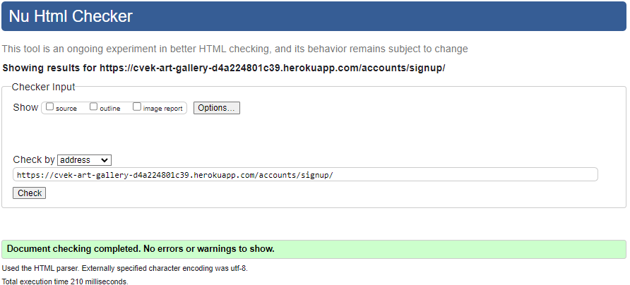
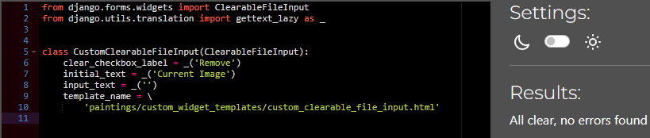
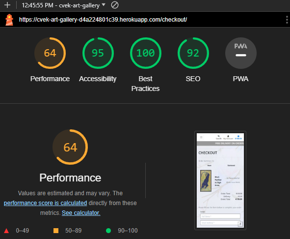
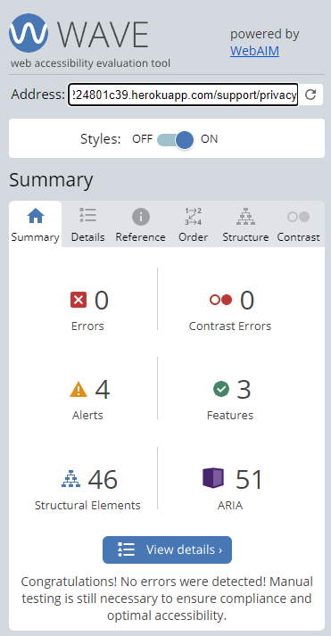

<!-- Code for readme adapted from author's own project (Portfolio 1),
https://github.com/Boiann/boudoir-studio -->

# **CVEK ART GALLERY - Testing** 

[Main README.md file](/README.md)

Visit the live site - [Cvek Art Gallery](https://cvek-art-gallery-d4a224801c39.herokuapp.com/ "Link to Cvek Art Gallery")

View GitHub [Repository](https://github.com/Boiann/cvek-art-gallery)

---
## **Contents**
* [Automated Testing](#automated-testing)
  * [W3C HTML Validator](#w3c-html-validator)
  * [W3C CSS Validator](#w3c-css-validator)
  * [JSHINT Javascript Validator](#jshint-javascript-validator)
  * [CI Python Linter](#ci-python-linter)
  * [Lighthouse](#lighthouse)

* [Accessibility](#accessibility) 
  * [WAVE WebAim](#wave-webaim) 

* [Manual Testing](#manual-testing)
  * [Testing User Stories](#testing-user-stories)
  * [Full Testing](#full-testing)
    * [Features](#features)
    * [Responsiveness](#responsiveness)

* [Bugs](#bugs)
  * [Known Bugs](#known-bugs)
  * [Solved Bugs](#solved-bugs)

* [Browser Compatibility](#browser-compatibility)      

---

## Automated Testing

### **W3C HTML Validator**

The [HTML W3C HTML Validator](https://validator.w3.org/#validate_by_uri+with_options) was used to validate the HTML code used, showing no errors.

HTML Validation:

 - Index
  

 - Paintings
  

 - Painting detail
  

 - Cart
  

 - Checkout
  

 - Checkout success
  

  - Newsletter
  

  - About the Artist
  

  - Contact Us
  

  - T&C's
  

 - Privacy
  

 - Log in
  

 - Log out
  

 - Register
  

 - My Account
  

 - Add Painting
  

---

### **W3C CSS Validator**

The [CSS Jigsaw CSS Validator](https://jigsaw.w3.org/css-validator/#validate_by_uri) was used to validate the CSS code used, showing no errors.

CSS Validation:

---

### **JSHINT Javascript Validator**

The [JsHint](https://jshint.com/) was used to validate the Javascript code used, showing no errors.

Javascript Validation:

---

### **CI Python Linter**

The [CI Python Linter](https://pep8ci.herokuapp.com/) was used to validate the Python code used, showing no errors.

---

#### Cart App

Cart App Validation:

 - contexts.py
  

 - urls.py
  

 - views.py
  

---

#### Checkout App

Checkout App Validation:

 - admin.py
  

 - forms.py
  

 - models.py
  

 - signals.py
  

 - urls.py
  

 - views.py
  

 - webhook_handler.py
  

 - webhooks.py
  

---

#### Root App - cvek_art_gallery

Root App Validation:

 - urls.py
  

 - views.py
  

---

#### Home App

Home App Validation:

 - urls.py
  

 - views.py
  

---

#### Paintings App

Paintings App Validation:

 - admin.py
  

 - forms.py
  

 - models.py
  

 - urls.py
  

 - views.py
  

 - widgets.py
  

---

#### Profiles App

Profiles App Validation:

 - forms.py
  

 - models.py
  

 - urls.py
  

 - views.py
  

---

#### Support App

Support App Validation:

 - forms.py
  

 - models.py
  

 - urls.py
  

 - views.py
  

---

### **Lighthouse**

[LightHouse](https://developer.chrome.com/docs/lighthouse/overview/) was used for testing performance.

#### Desktop:

Desktop Lighthouse Validation:

 - Index
  

 - Paintings
  

 - Painting detail
  

 - Cart
  

 - Checkout
  

 - Checkout success
  

  - Newsletter
  

  - About the Artist
  

  - Contact Us
  

  - T&C's
  

 - Privacy
  

 - Log in
  

 - Log out
  

 - Register
  

 - My Account
  

 - Add Painting
  

 - Edit Painting
  

---

#### Mobile:

Mobile Lighthouse Validation:

 - Index
  

 - Paintings
  

 - Painting detail
  

 - Cart
  

 - Checkout
  

 - Checkout success
  

  - Newsletter
  

  - About the Artist
  

  - Contact Us
  

  - T&C's
  

 - Privacy
  

 - Log in
  

 - Log out
  

 - Register
  

 - My Account
  

 - Add Painting
  

 - Edit Painting
  

---

[Back to top ⇧](#cvek-art-gallery---testing)

---

## **Accessibility**

### **WAVE WebAim**

[W.A.V.E.](https://wave.webaim.org/) was used to test for accessibility, showing no errors. Unfortunately cart, checkout and pages requiring login could not be tested on WebAim.

WAVE WebAim Validation:

 - Index
  

 - Paintings
  

 - Painting detail
  

  - About the Artist
  

  - Contact Us
  

  - T&C's
  

 - Privacy
  

 - Log in
  

 - Register
  

---

[Back to top ⇧](#cvek-art-gallery---testing)

---

## **Manual Testing**

### **Testing User Stories**

#### **First Time Visitor**

| User Story | Pass/Fail |
|------------|----------|
| I can open the home page so that I can see what this website is about. | PASS |
| I can effectively explore this website so that I can access all the info I need. | PASS |
| I can see a list of paintings so that I can select one or more to purchase. | PASS |
| I can find out more about the artist so that I can find out more about him. | PASS |
| I can modify my shopping bag so that I can adjust my purchase. | PASS |
| I can see a notification upon successful modifying/removing so that I can know I'm doing things right. | PASS |
| I can connect with the store/business on Facebook so I can follow on any news/updates/special offers. | PASS |

#### **Returning Customer**

| User Story | Pass/Fail |
|------------|----------|
| I want to be able to register and log in/out without issues. | PASS |
| I want to get an email notification so that my registration is confirmed. | PASS |
| I can search or sort by category of paintings so that I can select one or more to purchase. | PASS |
| I can see if there is anything on special offer so that I can save some money. | PASS |
| I can remove paintings from my shopping bag so that I can adjust my purchase. | PASS |
| I can have personalized user profile so I can view my order history. | PASS |
| I can subscribe to the store newsletter so I can know about any news/updates/special offers. | PASS |

#### **Website Admin/Owner**

| User Story | Pass/Fail |
|------------|----------|
| I can add/remove paintings from the store so I can remove sold out paintings and add new ones. | PASS |
| I can modify paintings in the store so I can update them with the right details. | PASS |
| I can see what the customer ordered, how much was paid, and was the discount applied. | PASS |

[Back to top ⇧](#cvek-art-gallery---testing)

### **Full Testing**

#### **Features**

### **Index**

Index page image carousel and shop now button opening paintings for sale, animated marquee, logo and title return to index working

<!-- GIF --> 

Index page dropdown menus opening respective pages/selections working

<!-- GIF --> 

Search funtion returning relevant paintings, returning category/subcategory, nothing found result working

<!-- GIF --> 

Subscription button opening subscription page working

<!-- GIF --> 

Footer nav links opening new page working

<!-- GIF --> 

Footer social media links open in a new tab working

<!-- GIF --> 

### **Account**

My Account dropdown links, register and log in pages with reverse links working

<!-- GIF --> 

Register page email required warning, password not matching warning, user already registered warning working

<!-- GIF --> 

Register page check email and validation working

<!-- GIF --> 

Successful sign-in success toast message, 3 sec delay before disappearing working

<!-- GIF --> 

Logging out 'are you sure' check and success toast message working

<!-- GIF --> 

Password reset functionality, email check working

<!-- GIF --> 

My Account page for details after user is logged in working

<!-- GIF --> 

Admin links in 'My Account' working

<!-- GIF --> 

### **Paintings**

All Paintings dropdown returns selected sorting working

<!-- GIF --> 

Paintings paginated view, sorting options and smooth return to top button working

<!-- GIF --> 

Paintings having in a category can have subcategory and return in the selected category working

<!-- GIF --> 

Painting detail view, info and frame selector working

<!-- GIF --> 

Painting in 'Clearance' subcat has no frames available, 20% discount working

<!-- GIF --> 

Admin painting detail view, edit and delete buttons visible, warning modals working

<!-- GIF --> 

Admin 'Product Management' link and adding new painting, no image working

<!-- GIF --> 

Admin 'Product Management' link and adding new painting, with image working

<!-- GIF --> 

Admin edit painting page modal and success message/s working

<!-- GIF --> 

Admin delete painting page modal and success message working

<!-- GIF --> 

### **Cart**

Add to cart success message and basket total updating, mini-view of cart with delivery warning and cart info working

<!-- GIF --> 

Add to cart success message and mini-view of cart with frame info and over 3 paintings in the cart message working

<!-- GIF --> 

Add to cart button with different frame selected updates the basket total working

<!-- GIF --> 

Cart page with paintings info, grand total calculation with delivery working

<!-- GIF --> 

Cart page with paintings info, grand total calculation with 3 paintings discount working

<!-- GIF --> 

Cart page with paintings info, grand total calculation with 6 paintings discount working

<!-- GIF --> 

Cart page with paintings info, update/change frame option, delete painting from cart working

<!-- GIF --> 

Cart page with paintings info, 'clearance' painting info and no frames options working

<!-- GIF --> 

Keep shopping button lists all paintings working

<!-- GIF --> 

### **Checkout**

Checkout page and order summary with relevant info about paintings to be purchased, discount visible working

<!-- GIF --> 

Adjust cart button returns to current cart working

<!-- GIF --> 

Order form not working without inputs working

<!-- GIF --> 

Successful purchase of unregistered user, email check working

<!-- GIF --> 

Successful purchase of registered user, email check working

<!-- GIF --> 

Successful purchase of registered user, order and details saved to 'My Profile' page working

<!-- GIF --> 

Successful purchase positive results from Stripe webhooks working

<!-- GIF --> 

### **Other**

Newsletter link opening subscribe page, thank you msg, already subscribed msg working

<!-- GIF --> 

About the Artist page working

<!-- GIF --> 

T&C's page working

<!-- GIF --> 

Privacy page working

<!-- GIF --> 

Contact us page, form inputs required, success redirect to index and email check working

<!-- GIF --> 

Error 400 page working

<!-- GIF --> 

Error 500 page working

<!-- GIF --> 

### **Admin page**

Admin can view details of orders working

<!-- GIF --> 

Admin can edit/delete details of orders and users working

<!-- GIF --> 

Admin can create new painting for sale on admin page working

<!-- GIF --> 

[Back to top ⇧](#cvek-art-gallery---testing)

#### **Responsiveness**

Responsiveness for the website was thoroughly tested for devices up to 320px wide using [Chrome Del Tools](https://developer.chrome.com/docs/devtools/).

Responsiveness test

[Back to top ⇧](#cvek-art-gallery---testing)

---

## **Bugs**

### **Known Bugs**

* No known bugs present in the project (disclaimer; that doesn't mean there are none) at the time of writing this readme/testing.

### **Solved Bugs**

There were many 'small' bugs that had to be dealt with during the development of the project. Most of them were squashed by doing a quick [Google](https://google.com/ "Google home page") search and using [Stack Overflow](https://stackoverflow.com/ "Stack Overflow home page") to find relevant solutions.

Two of the biggest bugs were with Stripe webhooks and in later development, connection to AWS. The webhook bug is documented through GitHub Issues, the AWS one was not unfortunately, mainly because it caused quite a bit of panic being so close to submission date.

- Image format not recognized - [BUG NO. 1](https://github.com/Boiann/cvek-art-gallery/issues/83).

- Implementing Subcategories into the project proved to be bit more difficult than it seemed but it worked out in the end. The remaining issue that was subsequently removed from the project was to get the current subcategory selected display as a nav-link below the navbar. The same implementation worked for categories, but for subcategories it displayed either all of the subcategories, or none at all. A lot of effort was put into this trying to solve it but due to the project deadline it was decided to leave it out, along with current category nav link as not to present links for categories but not for subcategories.

- First major bug was encountered while implementing Stripe and its webhooks. It took multiple days and tries for this to be solved, and it took away time from further development. The code was updated and reworked multiple times because there was lack of attention to details and testing scope on the developer's part. That bug lead directly to other one with the database. After overloading the code with `print()` statements, it was fixed. More about this bug in [BUG NO. 2](https://github.com/Boiann/cvek-art-gallery/issues/93).

- Forcing sku as unique identifier instead of painting_id was a mistake in retrospect, this caused additional time spent when reworking the code to use painting_id. This change necessity became apparent when trying to implement adding new paintings as admin. When using SKU-s, when SKU field was left empty when submitting new painting, nothing worked because SKU was missing and not automatically generated, and painting_id is.

- Search functionality was not working as it should, returning nothing if searched term was category/subcategory, which was solved and fixed quickly.

- Connecting the deployed Heroku site with AWS was, in short, a nightmare causing actual physical consequences. Brought on by, again, lack of attention to details. This caused so much upset that it was not documented, and by the time it was fixed it was decided it will be talked about in this section. This was stemming from the fact that a similar issue actually happened, and it was not considered to be possible again. And the fact that mentor and tutors were unable to help with the issue.
  - AWS bucket creation and wiring-up steps were followed diligently, but media files were not showing up no matter what.
  - A lot of trial and unfortunate errors were made trying to fix this, reflected in the number of commits submitted on this issue (form 'AWS Deployment' to 'Fix favicon img path, delete previous loadstatic files')
  - After seeking help with the images not loading, it was realized what the mistake was, not using template tags for logo. The paintings images not showing up was still an issue
  - Looking up on Slack, Stack-Overflow, Google, asking the mentor and tutors did not help
  - It was assumed the issue was in `DISABLE_COLLECTSTATIC` config var in Heroku, and that it somehow didn't connect/wire up with AWS
  - Slack community members suggested that `DISABLE_COLLECTSTATIC` should actually NOT be removed for the first time deployment connected with AWS, this was later looked into and the issue is actually having the debug mode set to true, and that was creating issues for some people
  - Trying to run collectstatic and 'fixing' static settings in settings.py only made things worse, lack of experience made it worse still
  - Finally, the mistake was caught - because of multiple projects in GitPod workspace each project had it's own `DATABSE_URL`, renamed to `DATABSE_URL_CAG` for this project. This was an issue before with Stripe, because `STRIPE_WH_SECRET` set to general user scope (Boiann/*) was returning webhooks from both Boutique Ado + CAG. This was caught early, fixed quickly, and promise was made to oneself - 'Don't do this again'. But it did happen again, because database Heroku Config var was using `DATABSE_URL`. Changing that config var to `DATABSE_URL_CAG` solved issues with media files.

 - Sitemap bug - when sitemap was created for the first time, it was over 2500 lines long. At first, this was thought to be an issue with missing robots.txt file. After that was added, the sitemap still returned very large. Other projects were tested to see their sitemap scope, all returned ok. After Google, Slack and Stack Overflow check, tutoring was contacted, yielding no clear instruction/advice. Upon closer examination, it was noticed that add/edit/delete painting links were crawled, which only a superuser can do. The issue was that the html presented no edit/delete buttons for regular user (superuser check) but the buttons were still present in the hidden modal. Adding superuser check within the modal itself solved this issue and returned sitemap of normal size. 

[Back to top ⇧](#cvek-art-gallery---testing)

---

## **Browser compatibility**

The website was tested on the following browsers with no issues found: Google Chrome, Mozilla Firefox, Microsoft Edge and Opera Browser.

 - Browser Compatibility image:
  

 

---

[Back to top ⇧](#cvek-art-gallery---testing)